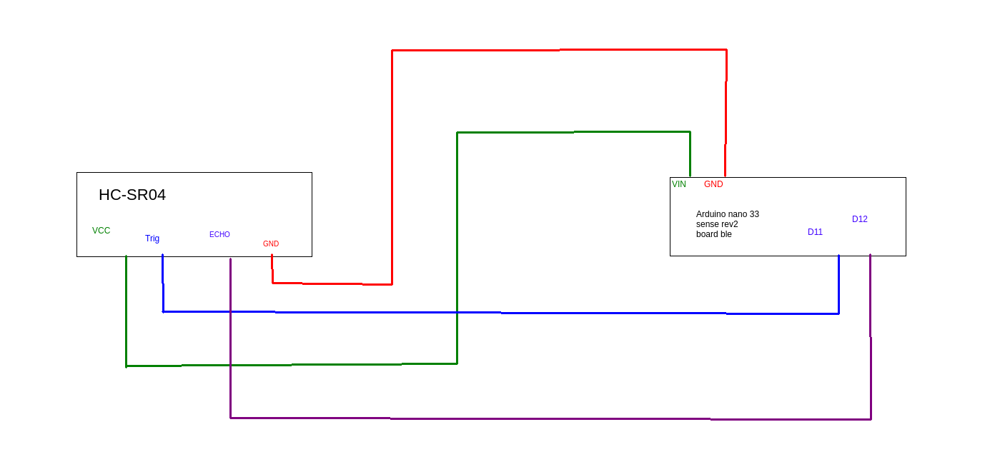

Comment lancer les programmes:

- Ouvrir deux terminales
- Taper "python server.py" pour lancer le serveur python, si cela ne marche pas installer les librairies demandées
- Si vous ne pouvez pas installer les librairies, activer l'environnement virtuel avec "source env/bin/activate" et recommencer
- Basculer sur l'autre terminale et taper "node server.js"
- Ouvrer une page web et entrer "localhost:3000"

Python library:
- flask (Microframework qui facilitent la création d'app web)
- ollama (API hebergeur de modele d'ia t'elle que Mistral)
- requests

JS library (server):
- axios (permet de faire des requettes HTTP)
- serialport (Lance et recuperer les informations printer du script Arduino)
- socket-io (permet de communiquer entre serveur et client grace a des events)
- socket-io-client
- express (un framework basés sur les applications web)
- node:http

Cablage arduino : 